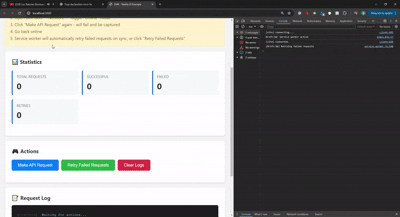
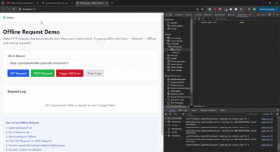

# Drift

**Drift** is an **offline-first framework for React applications** designed to keep your app **usable and consistent under any network conditions**.  
Whether your users are on a plane, in a subway tunnel, or stuck with flaky Wi-Fi, Drift ensures your app **never loses user actions** and stays **responsive**.

---

## 🎯 Why Drift?

Modern apps often assume “always online.” In reality, networks fail, drop, or lag at the worst moments. Drift solves this by providing a **resilient foundation for offline-first behavior**:

* **Never lose an action:** All mutations (create, update, delete) are safely queued in a **Write-Ahead Log (WAL)**.
* **Optimistic UI updates:** Changes appear instantly, keeping the interface responsive.
* **Automatic recovery:** Offline actions replay automatically once connectivity returns.
* **Conflict resolution:** Strategies ensure data consistency, preventing drift.
* **Developer-first:** Hooks and dev tools make offline-first integration seamless.

In short: **Drift keeps your app reliable, predictable, and developer-friendly, no matter the network conditions.**

---

## ✨ Core Concepts

### Write-Ahead Log (WAL)

An append-only queue stored in **IndexedDB**. It captures all outbound requests while offline to ensure **nothing is lost**.

### Replay Engine

Automatically flushes WAL entries when online, with configurable **retry** and **backoff** strategies.

### Adapters

Supports multiple transports, including **REST (fetch)**, **GraphQL**, and **WebSockets**.

### React Integration

Hooks like `useOfflineMutation` and `useOfflineQuery` make offline-first behavior a **one-line change** in your React components.

### Developer Tools

Inspect, replay, pause, and debug WAL operations in real time.

---

## Examples

### Vanilla JS

### React

---

## 📦 Packages

* @negretenico/lib – WAL, replay engine

* @negretenico/react – React provider, hooks

* @negretenico/sw – Service Worker integration for background sync
